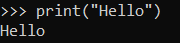

# Praktikum2 Fardhilan Galang Priarto 
## Latihan 1
# Syntax Dasar
Dibawah ini adalah contoh fungsi Python yang digunakan untuk mencetak. Di Python untuk mencetak cukup gunakan fungsi print()
```
print("Hello")
```
Outputnya akan seperti ini


```
print("Saya sedang belajar python")
```
Outputnya akan seperti ini

## Latihan 2
# Penggunaan Variable Dasar
Dilatihan kedua ,kita bisa menukarkan isi dari dua variabel tanpa harus menggunakan variabel tambahan
